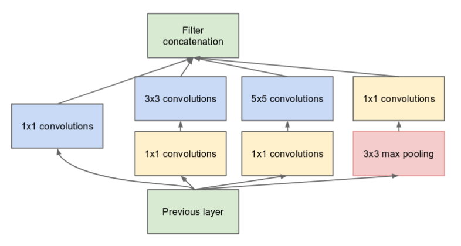

# What is Face Recognition ?
<u>Face recognition</u> is a computer vision task of identifying and verifying a person based on a photograph of their face. 

<u>Face detection</u> is the process of automatically locating faces in a photograph and localizing them by drawing a bounding box around their extent.

This problem of face detection and recognition can be broadly divided into two classes.

Face Verification - is this the claimed person? For example, at some airports, you can pass through customs by letting a system scan your passport and then verifying that you (the person carrying the passport) are the correct person. A mobile phone that unlocks using your face is also using face verification. This is a 1:1 matching problem.

Face Recognition - who is this person? For example, the video below of some employees entering the office without needing to otherwise identify themselves. This is a 1:K matching problem.

**References**:

Florian Schroff, Dmitry Kalenichenko, James Philbin (2015). [FaceNet: A Unified Embedding for Face Recognition and Clustering](https://arxiv.org/pdf/1503.03832.pdf)

Our implementation also took a lot of inspiration from the official FaceNet github repository: https://github.com/davidsandberg/facenet

Implementation of Facenet available as Pip Package (face-recognition) : https://pypi.org/project/face_recognition/

https://medium.com/intro-to-artificial-intelligence/one-shot-learning-explained-using-facenet-dff5ad52bd38

https://medium.com/@tomdeore/facenet-architecture-part-1-a062d5d918a1

** Step up **

<u>Prerequisites</u>
1. cmake
2. Python 3.5+

<u>Steps</u>
`pip install face_recognition`
`pip install flask requests`

</u>How to use</u>

1. Create a directory /tmp/upload :: `mkdir /tmp/upload`
2. Run app.py :: `python app.py`. this is flask app, which gives two endpoints, _register and predict_. Register atleast one user before starting the prediction job. `endpoint:: http://localhost:5001/register`
3. Run Presentation.ipynb in jupyter version 1.0+ execute all cells in sequence. PS: Last code block runs an infinite loop (while True) which will bring up an camera sreen where you can see predictions.
